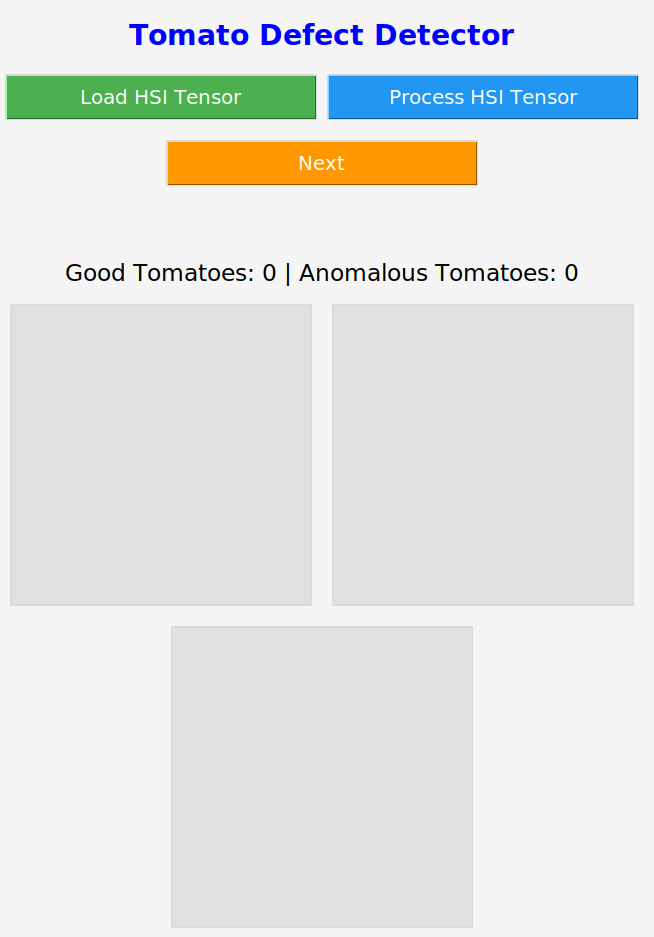

### Overview
# 🍅 Tomato Defect Detection with VAE & Hyperspectral Imaging

This project presents an unsupervised anomaly detection system for tomatoes using **Variational Autoencoders (VAE)** and **Hyperspectral Imaging (HSI)**. The system identifies defects such as dry splits by analyzing reconstruction errors in hyperspectral data, offering a non-invasive solution for quality control in agricultural settings.

---

## 🔬 Key Features

- **Unsupervised Anomaly Detection**: Utilizes a tailored VAE model to detect anomalies in hyperspectral images without the need for labeled data.
- **Hyperspectral Imaging**: Analyzes spectral data in the 530–550 nm range to identify subtle defects in tomato skins.
- **User-Friendly GUI**: Provides an intuitive interface for users to load hyperspectral images, run anomaly detection, and visualize results interactively.
- **Real-Time Feedback**: Displays anomaly scores and highlights potential defects directly on the GUI.
- **Data Visualization**: Includes tools for visualizing reconstruction errors and anomaly maps.

---

## 🧪 Technologies

- **Programming Language**: Python 3.x
- **Libraries**:
  - `PyQt5`: For GUI development
  - `torch`, `torchvision`: For model implementation
  - `numpy`, `scipy`: For numerical operations
  - `matplotlib`, `seaborn`: For data visualization
  - `scikit-learn`: For data preprocessing and evaluation
- **Model**: Variational Autoencoder (VAE) tailored for hyperspectral image data

---

